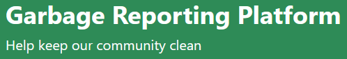
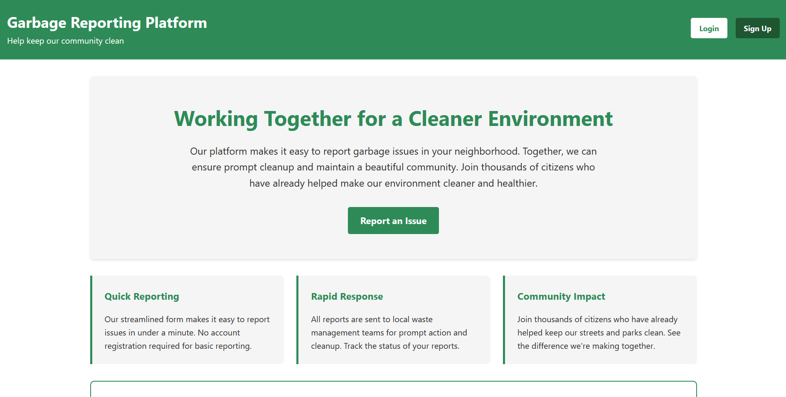

<div align="center">

  
  <h1>Garbage Reporting Platform</h1>
  
  <p>
    A community-driven platform to report and track garbage cleanup issues
  </p>

  
<!-- Badges -->
<p>
  <a href="https://github.com/NescafeAlgeria/GaW/graphs/contributors">
    
  </a>
  <a href="">
    
  </a>
  <a href="https://github.com/NescafeAlgeria/GaW/network/members">
    
  </a>
  <a href="https://github.com/NescafeAlgeria/GaW/stargazers">
    
  </a>
  <a href="https://github.com/NescafeAlgeria/GaW/issues/">
    
  </a>
  <a href="https://github.com/NescafeAlgeria/GaW/blob/master/LICENSE">
    
  </a>
</p>
   
<h4>
    <!-- <a href="https://github.com/NescafeAlgeria/GaW/">View Demo</a>
  <span> · </span> -->
    <a href="https://github.com/NescafeAlgeria/GaW">Documentation</a>
  <span> · </span>
    <a href="https://github.com/NescafeAlgeria/GaW/issues/">Report Bug</a>
  <span> · </span>
    <a href="https://github.com/NescafeAlgeria/GaW/issues/">Request Feature</a>
  </h4>
</div>

<br />

<!-- Table of Contents -->
# Table of Contents

- [About the Project](#about-the-project)
  * [Tech Stack](#tech-stack)
  * [Features](#features)
  * [Color Reference](#color-reference)
  * [Environment Variables](#environment-variables)
- [Getting Started](#getting-started)
  * [Prerequisites](#prerequisites)
  * [Installation](#installation)
  * [Run Locally](#run-locally)
- [Usage](#usage)
- [Roadmap](#roadmap)
- [Contributing](#contributing)
- [License](#license)
- [Contact](#contact)
- [Acknowledgements](#acknowledgements)
  

<!-- About the Project -->
## About the Project

<div align="center"> 
  
</div>

The Garbage Reporting Platform is a community-driven web application designed to help citizens report garbage and waste management issues in their neighborhoods. The platform streamlines the process of reporting environmental concerns and connects citizens directly with local cleanup crews and waste management teams.

Our mission is to create cleaner, healthier communities by empowering citizens to take an active role in environmental stewardship. With features like quick reporting, real-time tracking, and community engagement, we make it easier than ever to maintain beautiful neighborhoods.

<!-- TechStack -->
### Tech Stack

<details>
  <summary>Client</summary>
  <ul>
    <li><a href="https://developer.mozilla.org/en-US/docs/Web/HTML">HTML5</a></li>
    <li><a href="https://developer.mozilla.org/en-US/docs/Web/CSS">CSS3</a></li>
    <li><a href="https://developer.mozilla.org/en-US/docs/Web/JavaScript">JavaScript</a></li>
  </ul>
</details>

<details>
  <summary>Server</summary>
  <ul>
    <li><a href="https://nodejs.org/">Node.js</a></li>
  </ul>
</details>

<details>
<summary>Database</summary>
  <ul>
    <li><a href="https://www.mongodb.com/">MongoDB</a></li>
  </ul>
</details>

<!-- <details>
<summary>Authentication</summary>
  <ul>
    <li><a href="https://jwt.io/">JSON Web Tokens</a></li>
  </ul>
</details> -->

<!-- Features -->
### Features

- **Quick Reporting**: Submit garbage reports in under a minute with our streamlined form
- **User Authentication**: Secure login and signup system for tracking personal reports
- **Real-time Tracking**: Monitor the status of your submitted reports from submission to cleanup
- **Community Impact**: View statistics and see the collective impact of community efforts
- **Location-based Reporting**: Integrated mapping for precise location reporting
<!-- Color Reference -->
### Color Reference

| Color Name       | Hex Code  |
| ---------------- | --------- |
| Primary Green    | `#2E8B57` |
| Primary Light    | `#3CB371` |
| Primary Dark     | `#1E5631` |
| Text Dark        | `#333333` |
| Background Light | `#F5F5F5` |
| White            | `#FFFFFF` |


<!-- Env Variables -->
### Environment Variables

To run this project, you will need to add the following environment variables to your .env file

`MONGO_URL` - MongoDB connection string

<!-- Getting Started -->
## Getting Started

<!-- Prerequisites -->
### Prerequisites

This project requires Node.js and npm to be installed on your system.

```bash
 node --version
 npm --version
```

You'll also need MongoDB installed locally or access to a MongoDB Atlas cluster.

<!-- Installation -->
### Installation

Install the Garbage Reporting Platform

```bash
  git clone https://github.com/NescafeAlgeria/GaW.git
  cd GaW
  npm install
```

<!-- Run Locally -->
### Run Locally

Clone the project

```bash
  git clone https://github.com/NescafeAlgeria/GaW.git
```

Go to the project directory

```bash
  cd GaW
```

Install dependencies

```bash
  npm install
```

Create environment variables file

```bash
  cp .env.example .env
```

Start the MongoDB service (if running locally)

```bash
  mongod
```

Start the server

```bash
  node .
```

<!-- Usage -->
## Usage

The Garbage Reporting Platform provides an intuitive interface for community members to report and track garbage cleanup issues.

**For Citizens:**
- Visit the homepage and click "Report an Issue"
- Fill out the quick form with location and issue details

**For Administrators:**
- Access the admin dashboard to view and manage reports
- Assign cleanup crews to reported issues
- Update report status and add resolution notes
- View community impact statistics

**Example API Usage:**

```javascript
// Submit a new garbage report
fetch('/api/addReport', {
        method: 'POST',
        headers: {
            'Content-Type': 'application/json'
        },
        body: JSON.stringify({
            severity: severity,
            lat: lat,
            lng: lng,
            description: description,
            category: category
        })
});
```

<!-- Roadmap -->
## Roadmap

* [x] Basic reporting functionality
* [x] User authentication system
* [ ] Responsive web design
* [ ] Mobile app development
* [ ] Integration with city waste management APIs
* [ ] Real-time notifications via WebSocket
* [ ] Gamification features (points, badges)
* [ ] Multi-language support
* [ ] Advanced analytics and reporting
* [ ] Integration with social media platforms

<!-- Contributing -->
## Contributing

<a href="https://github.com/NescafeAlgeria/GaW/graphs/contributors">
  
</a>

Contributions are always welcome! We believe in the power of community collaboration to create better environmental solutions.

<!-- Code of Conduct
### Code of Conduct

Please read the [Code of Conduct](https://github.com/NescafeAlgeria/GaW/blob/master/CODE_OF_CONDUCT.md) -->

<!-- License -->
## License

Distributed under the MIT License. See LICENSE.txt for more information.

<!-- Contact -->
## Contact
<!-- 
Project Maintainer - [@your_twitter](https://twitter.com/your_twitter) - your.email@example.com
-->
Project Link: [https://github.com/NescafeAlgeria/GaW](https://github.com/NescafeAlgeria/GaW) 

<!-- Acknowledgments -->
## Acknowledgements

This project was built with the help of these amazing resources and communities:


 - [MongoDB Documentation](https://docs.mongodb.com/)
 - [MDN Web Docs](https://developer.mozilla.org/)
 - [Environmental Protection Agency](https://www.epa.gov/)
 - [Open Source Community](https://opensource.org/)